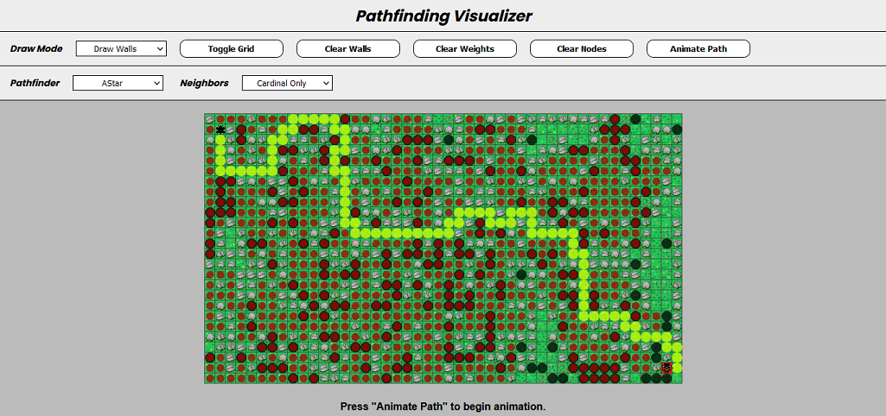
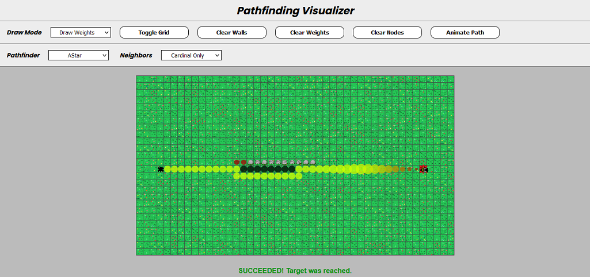

##What is this?
An implementation of a pathfinding visualizer written in TypeScript. It implements Dijkstra's Algorithm, AStar, Breath-first Search (BFS), and Depth-first Search (DFS), Greedy Best Search, and Bidirectional Search.

[Click here to try it out](https://alanfx8.github.io/PathfindingVisualizer/)

Rather than use coloured squares, sprites are used to represent a bee flying towards a flower, with small rocks representing obstacles.

Users can move the bee's start position and flower, add rocks and weights, toggle the grid, and choose how many neighbors a node examines when pathfinding.

##IMAGES

  

A maze with walls and weights

  

AStar in action

  

DFS with diagonal neighbours included